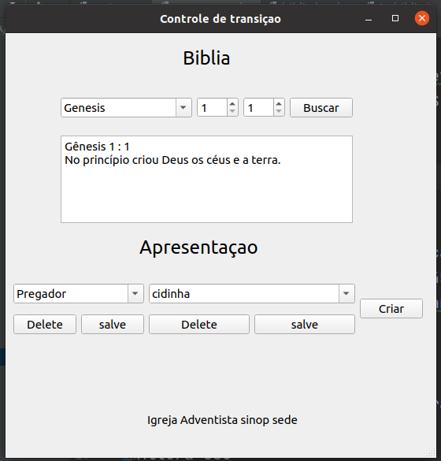
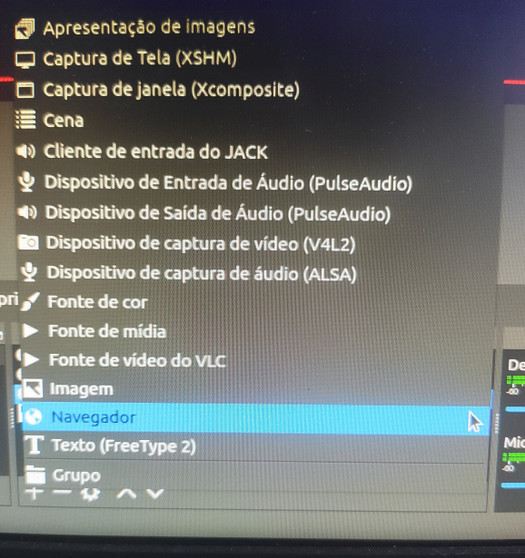

# obs_studio_animator
Esse programa foi criado com objetivo de auxilar a transmisão de
programação da igreja usando OBS.

A aplicação permite inserir de forma rápida e simples os textos bíbilos e criar aviso com nome do orador

 # Instalação
Atualmente fornecemos versões compilada para Windows.
https://drive.google.com/drive/folders/1lFkMeV0yZtnVIvgpDtntJxD01ia-ABn6?usp=sharing
 

# Configuração
No obs devemos importar como uma página de internet local

### Bíblia
* importar navegador (Browser) marque local file, aponte para o ariquivo biblia.html (dentro da pasta templates)
* defina largura=1080 e altura=450. 
* Marcar Atulaizar navegador quando tornar-se ativa

### para aviso
* importar navegador (Browser) marque local file, aponte para o ariquivo aviso.html (dentro da pasta templates)
* defina largura=1200 e altura=300. 
* Marcar Atulaizar navegador quando tornar-se ativa

# Informações para desenvolvedor.

## dependencia 
* python3
* PyQt5
* beautifulsoup4

## install mac

brew install python3
pip3 install PyQt5
pip3 install beautifulsoup4

## install linux (Ubuntu)

sudo apt install python3
pip3 install PyQt5
pip3 install beautifulsoup4

## Windows
Presica instalar manualmento o python3, o pip3 vem junto.
